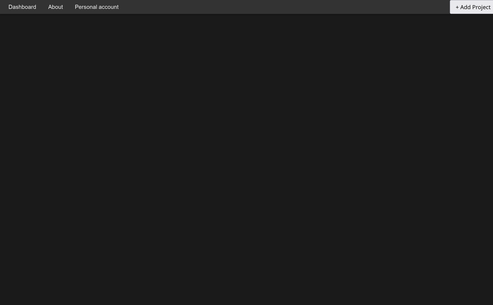
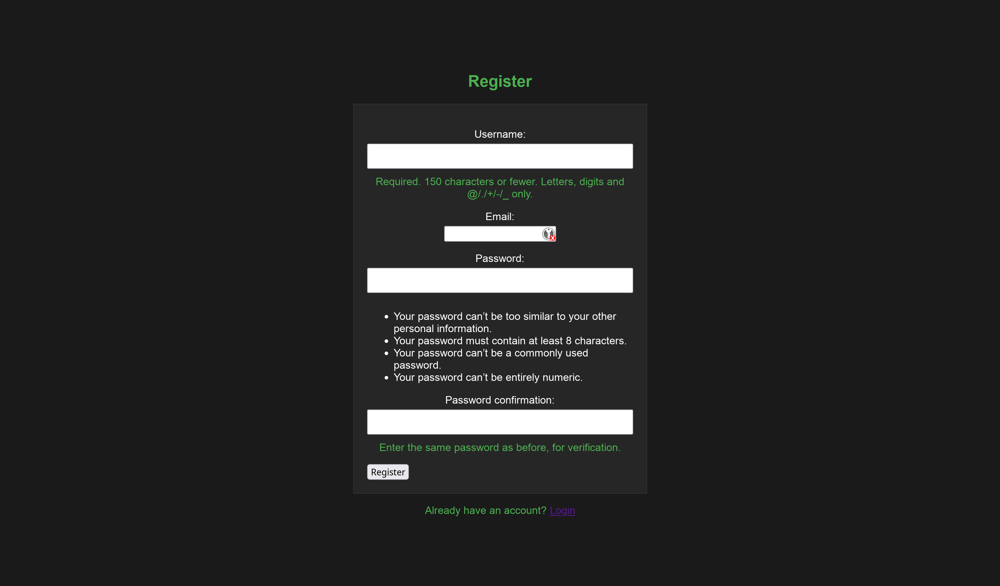
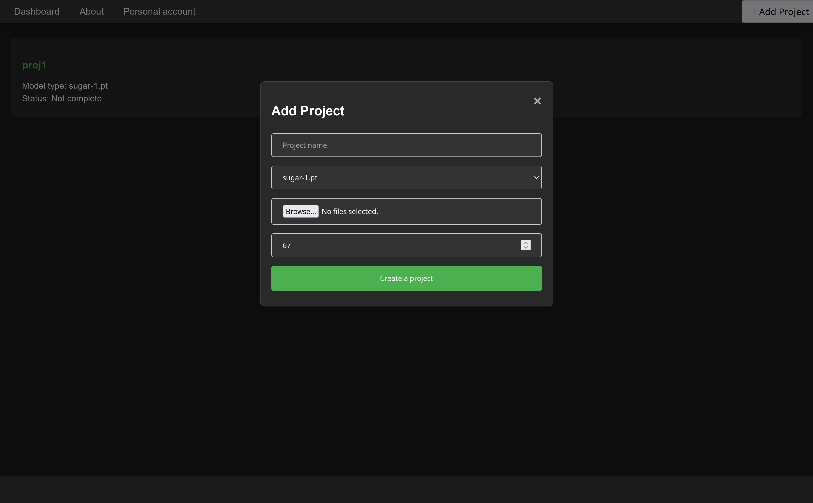
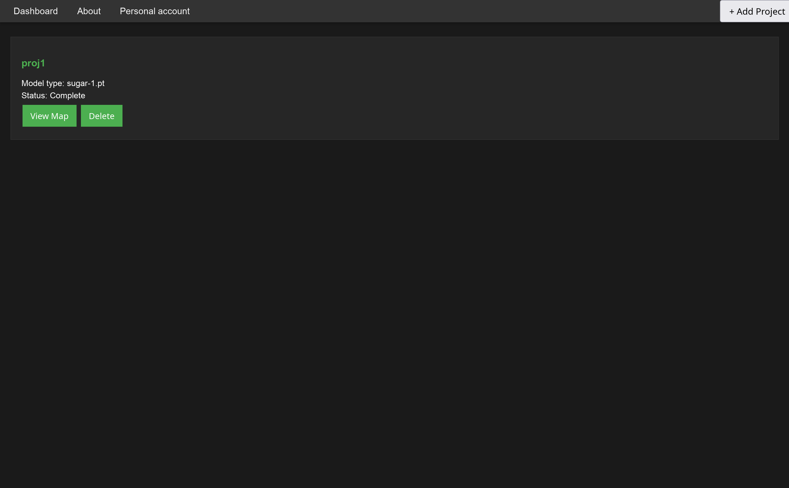
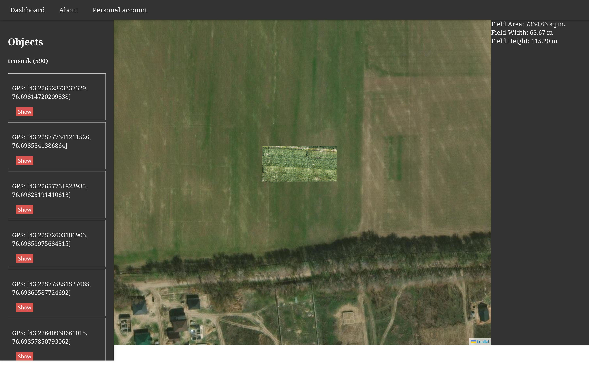

# Agrosystem

Это проект, связанный с аграрными системами, который включает в себя функциональность для обработки асинхронных задач с использованием Celery и Django. Он предназначен для управления и анализа данных в сельскохозяйственной отрасли.

## Установка

Для установки и настройки проекта выполните следующие шаги:

```bash
git clone git@github.com:ZeasusMedusa/agrosystem.git
cd agrosystem
pip install -r requirements.txt
```

Так же необходимо установить и запустить сервер [redis](https://docs.celeryq.dev/en/stable/getting-started/backends-and-brokers/redis.html#broker-redis).

В файле settings.py, так же нужно будет настроить celery, указав нужный ip:port в этих строках:

```python
# Подключение к Redis
CELERY_BROKER_URL = 'redis://localhost:6379/0'

# Опционально: использование Redis для результатов задач
CELERY_RESULT_BACKEND = 'redis://localhost:6379/0'
```

```bash
git clone git@github.com:ZeasusMedusa/agrosystem.git
cd agrosystem
pip install -r requirements.txt
```

## Запуск проекта

Для запуска проекта используйте следующие команды:

1. Запуск Celery worker:
   
   ```bash
   celery -A agrosystem.celery worker --loglevel=info
   ```

2. Запуск Django сервера:
   
   ```bash
   python manage.py runserver
   ```

## Структура проекта

- `projects/`: Директория для проектов (содержимое не отслеживается).
- `agrosystems/static/models/`: Директория для моделей (содержимое не отслеживается).

## Авторы

- [Zeasus Medusa](https://github.com/ZeasusMedusa)

Отлично, вот дополнения к документации по использованию веб-интерфейса:

## Веб-интерфейс

Веб-интерфейс предоставляет следующие функции:

### Главная страница



На главной странице отображается список всех существующих проектов. Здесь можно получить общую информацию о проектах и перейти к их детальному просмотру.

### Регистрация



Страница регистрации позволяет новым пользователям создать учетную запись для доступа к функциям системы.

### Добавление проекта



Через данную страницу авторизованные пользователи могут создавать новые проекты, заполняя необходимую информацию и загружая исходные данные.

### Главная страница после добавления проекта



### Удаление проекта

При нажатии на кнопку delete можно удалить проект.

Здесь пользователи могут удалить существующий проект из системы.

### Открытие проекта

При нажатии на кнопку View Map открываеться страница с интерактивной картой.



На странице проекта отображается детальная информация о выбранном проекте, включая интерактивную карту с результатами анализа данных. Пользователи могут взаимодействовать с картой и просматривать подробные сведения.